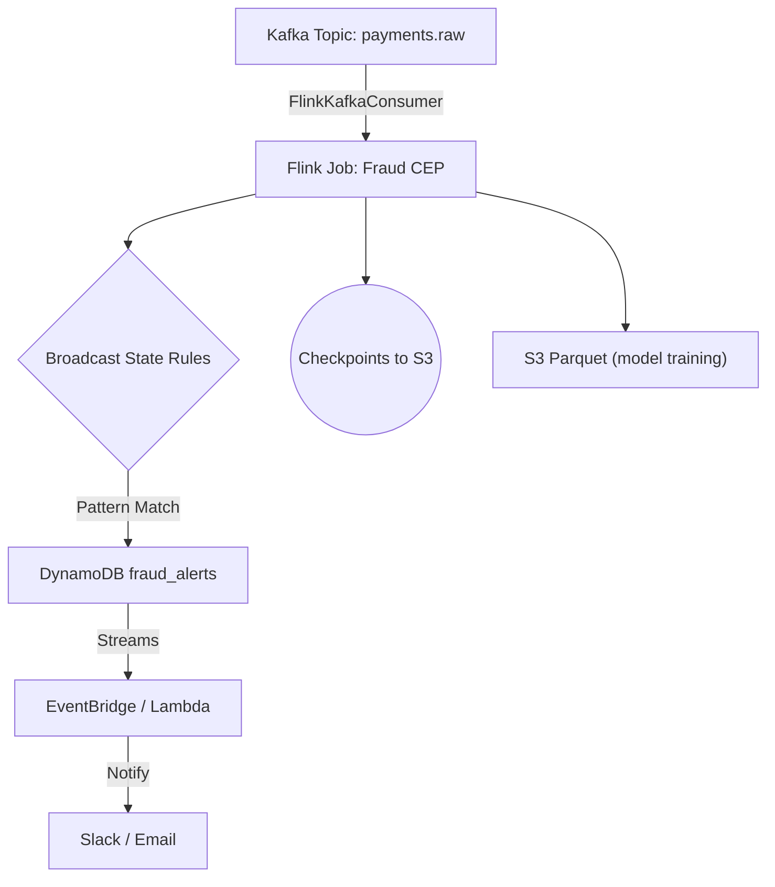

# Fraud Detection Pipeline (Kafka → Flink → DynamoDB)

Catch suspicious payments in **< 200 ms** on your laptop, then scale the same JAR to AWS.

---

## Overview

This project is a real-time fraud detection pipeline leveraging Apache Kafka, Apache Flink (CEP), and Amazon DynamoDB. It is designed for both local development and seamless scaling to AWS, enabling rapid detection of suspicious payment patterns with low latency.

- **Ingestion:** Payments ingested via Kafka (Dockerized for local dev)
- **Stream Processing:** Flink CEP detects fraud patterns in real time
- **State Management:** RocksDB (local), S3 (production)
- **Alerting:** Alerts written to DynamoDB, with fan-out to Lambda/Slack/SNS

For a deep dive into the architecture, code, and extension points, see the [`docs/`](docs/) folder.

---

## Key Features

|   Component | Tech                        | Notes                                      |
| ------------- | --------------------------- | ------------------------------------------ |
| Ingestion     | **Apache Kafka** (Docker)   | Exactly-once, ≤ 10 k ev/s local; MSK ready |
| Stream Logic  | **Apache Flink CEP 1.20**   | Pattern: 3 high-value txns / 5 min         |
| State Store   | **Flink RocksDB**           | Incremental checkpoints → S3 (prod)        |
| Alert Sink    | **Amazon DynamoDB**         | TTL = 24 h, Streams → Lambda               |
| Fan-out       | **AWS Lambda** (serverless) | Slack / SNS notifications                  |

> **SLA:** 99th percentile end-to-end latency ≤ 200 ms @ 1 M ev/s (see [Load Testing](docs/load-testing.md))

---

## Architecture



For a detailed explanation, see [`docs/architecture.md`](docs/architecture.md).

---

## Quick Start (Local)

```bash
# 1. Clone
$ git clone https://github.com/wahab-cide/fraud-detection && cd fraud-detection

# 2. Spin up mini-cluster (Kafka + Flink + DynamoDB-Local)
$ docker compose up -d  # first pull ≈1 GB, later runs instant

# 3. Build fat JAR & deploy
$ ./gradlew shadowJar
$ docker cp build/libs/fraud-detection-all.jar $(docker compose ps -q jobmanager):/jars/
$ docker compose exec jobmanager flink run -d -p 1 -c com.fraud.FraudCEP /jars/fraud-detection-all.jar

# 4. Generate synthetic payments (≈10 k ev/s)
# (tools/generator.py not found; see docs/synthetic-data.md for alternatives)

# 5. Watch dashboard
http://localhost:8081  # Flink UI
```

Stop everything:

```bash
docker compose down -v  # removes volumes
```

---

## Project Structure

```
fraud-detection/
├── docker-compose.yml   # local infra
├── build.gradle         # Gradle 8 + Shadow
├── src/main/java/...    # Flink job & models
├── docs/                # Deep documentation
└── ...
```

---

## Load Test Results

| Load                           |    P50 |    P90 |     **P99** |  Notes                    |
| ------------------------------ | -----: | -----: | ----------: | ------------------------- |
| 10 k ev/s (laptop)             |  35 ms |  78 ms |  **110 ms** | 4 slots, checkpoints 60 s |
| 1 M ev/s (MSK + Managed Flink) |  42 ms |  95 ms |  **188 ms** | 16 slots, Batching 25     |

Full script in `docs/load-testing.md` (original `load-test/` directory not found).

---

## Further Reading

- [docs/architecture.md](docs/architecture.md): Data flow, scaling, and AWS deployment
- [docs/code-structure.md](docs/code-structure.md): Main classes and extension points
- [docs/fraud-logic.md](docs/fraud-logic.md): How fraud patterns are detected
- [docs/synthetic-data.md](docs/synthetic-data.md): Generating test data
- [docs/load-testing.md](docs/load-testing.md): Load testing methodology
- [docs/faq.md](docs/faq.md): Troubleshooting and FAQ

---

## License

MIT (see LICENSE)


