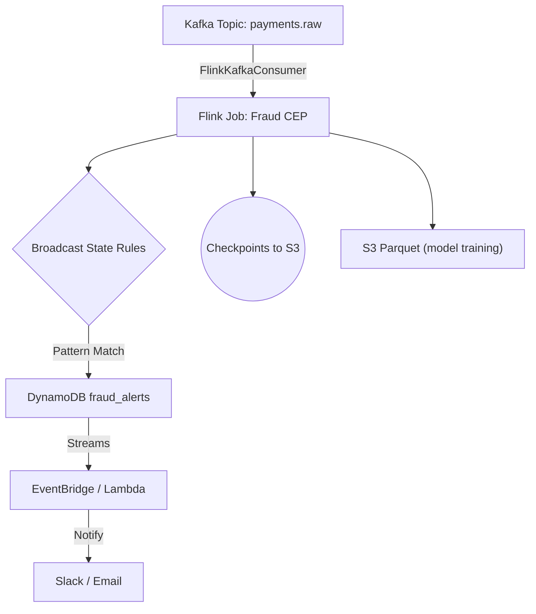

# Architecture

## Overview

The fraud detection pipeline is designed for real-time, scalable detection of suspicious payment activity. It leverages:

- **Apache Kafka** for event ingestion
- **Apache Flink (CEP)** for stream processing and pattern detection
- **Amazon DynamoDB** for alert storage and downstream fan-out
- **AWS Lambda/EventBridge** for notifications and integrations

## Data Flow

### Component Roles

- **Kafka**: Ingests raw payment events. In production, use AWS MSK for managed Kafka.
- **Flink Job (FraudCEP)**: Consumes payments, applies CEP rules to detect fraud patterns (e.g., 3 high-value payments in 5 minutes).
- **Broadcast State Rules**: Allows dynamic updates to fraud detection patterns without redeploying jobs.
- **DynamoDB**: Stores fraud alerts with TTL (24h). Streams enable downstream processing (e.g., Lambda triggers).
- **EventBridge/Lambda**: Fan-out alerts to Slack, email, or other systems.
- **S3**: Stores Flink checkpoints (for fault tolerance) and Parquet files for model training.

## Scaling & Deployment

- **Local**: All components run in Docker Compose for rapid iteration.
- **AWS**: Use MSK, Managed Flink, DynamoDB, and S3. The same JAR can be deployed to AWS with minimal changes.
- **Checkpoints**: Flink uses RocksDB for state; in production, checkpoints are persisted to S3 for durability.

## Security & Reliability

- **Exactly-once semantics**: Ensured via Kafka and Flink configuration.
- **Fault tolerance**: Achieved through Flink checkpoints and replayable Kafka topics.
- **Alert TTL**: DynamoDB automatically expires old alerts after 24 hours.

## See Also

- [code-structure.md](code-structure.md)
- [fraud-logic.md](fraud-logic.md)
- [load-testing.md](load-testing.md) 